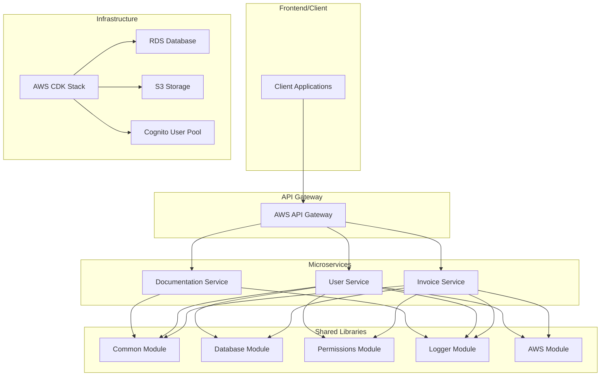

# SLS Boilerplate

A modern, scalable serverless microservices architecture built with NestJS, Serverless Framework v4, and AWS CDK. This boilerplate implements Vertical Slice Architecture with comprehensive developer tooling and best practices.

## 🏗️ Architecture Overview

This project follows **Vertical Slice Architecture** where each feature is self-contained with its own data access, business logic, and API endpoints. The architecture is designed for scalability, maintainability, and developer productivity.



## 🚀 Key Technologies & Patterns

| Technology | Purpose | Version |
|------------|---------|---------|
| **Serverless Framework** | Infrastructure orchestration | v4 |
| **NestJS** | Backend framework | v10 |
| **Drizzle ORM** | Database access layer | v0.44 |
| **AWS CDK** | Infrastructure as Code | Latest |
| **CASL/Ability** | Role-based access control | v6 |
| **Lambda PowerTools** | Structured logging | v2 |
| **Swagger** | API documentation | v7 |
| **Jest** | Testing framework | v29 |

## 📁 Project Structure

```
sls-boilerplate/
├── apps/                          # Microservices
│   ├── invoice/                   # Invoice management service
│   ├── user/                      # User management service
│   └── docs/                      # API documentation service
├── libs/                          # Shared libraries
│   ├── common/                    # Common utilities & middleware
│   ├── db/                        # Database layer & repositories
│   ├── permissions/               # RBAC implementation
│   ├── logger/                    # Structured logging
│   ├── aws/                       # AWS service integrations
│   ├── domain/                    # Domain services
│   ├── integrations/              # External API integrations
│   └── user-context/              # User context management
├── infrastructure/                # AWS CDK infrastructure
├── scripts/                       # Build & deployment scripts
└── shared/                        # Serverless configuration
```

## 🔧 Shared Libraries & Core Components

### Common Module (`@app/common`)
The common module provides essential utilities and middleware used across all services:

#### **Configuration Provider** (`config-provider.ts`)
- Environment-based configuration management
- Supports nested property access (e.g., `database.host`)
- Static and instance-based configuration access
- Type-safe configuration retrieval

#### **NestJS Utilities** (`nest.ts`)
- **Bootstrap Function**: Creates NestJS server for Lambda handlers
- **Shared Module**: Global module with common middleware and services
- **Base API Module**: Foundation for all API services
- **Swagger Integration**: Automatic API documentation generation
- **Worker Initialization**: Support for background Lambda functions

#### **Utility Functions** (`utils.ts`)
- **Data Sanitization**: Input validation and sanitization
- **Date/Time Handling**: Timezone-aware date formatting and conversion
- **String Manipulation**: Email masking, membership number masking
- **Currency Formatting**: Standardized currency display
- **Type Safety**: Null/undefined handling and type checking

#### **Middleware Stack**
- **Logging Middleware**: Structured request logging with metadata
- **User Context Middleware**: User context management and cleanup
- **Audit Middleware**: Comprehensive audit trail with Kinesis Firehose integration

### Domain Layer (`@app/domain`)
Shared business logic that spans multiple services:
- **Invoice Services**: Business calculations and validations
- **Cross-service Logic**: Reusable domain rules and calculations
- **Business Rules**: Centralized business logic implementation

### External Integrations (`@app/integrations`)
External service integrations and API clients:
- **Google Places API**: Location and place data services
- **Extensible Architecture**: Easy addition of new external services
- **Service Abstraction**: Clean separation from business logic

### Database Layer (`@app/db`)
- **Repository Pattern**: Abstracted data access layer
- **Drizzle ORM**: Type-safe database operations
- **Schema Management**: Centralized database schema definitions
- **Migration Support**: Database version control

### AWS Services (`@app/aws`)
- **DynamoDB**: NoSQL database operations
- **S3**: File storage and management
- **Kinesis Firehose**: Real-time data streaming
- **Service Abstraction**: Clean AWS service interfaces

## 🛠️ Prerequisites & Setup

### Requirements
- **Node.js**: >= 22.0.0
- **AWS CLI**: Configured with appropriate credentials
- **Docker**: For local database (optional)

### Initial Setup

1. **Clone and Install Dependencies**
```bash
git clone <repository-url>
cd sls-boilerplate
npm install
```

2. **Environment Configuration**
```bash

# Configure your environment variables
# - AWS credentials
# - Database connections
# - External service API keys
```

3. **Database Setup**
```bash
# Generate database migrations
npm run db:generate

# Apply migrations
npm run db:migrate

# Or push schema changes directly
npm run db:push
```

## 🔧 Development Workflow

### Available NPM Scripts

| Script | Description |
|--------|-------------|
| `npm run build` | Build current service with webpack |
| `npm run build:all` | Build all microservices sequentially |
| `npm run dev` | Start serverless offline mode |
| `npm run watch:service <service>` | Watch mode for specific service |
| `npm run test` | Run unit tests |
| `npm run test:e2e` | Run end-to-end tests |
| `npm run test:cov` | Run tests with coverage |
| `npm run lint` | Lint and fix code |
| `npm run format` | Format code with Prettier |
| `npm run clean` | Clean build artifacts |
| `npm run deploy` | Deploy to specified environment |
| `npm run deploy:service <service>` | Deploy specific service |

### Local Development

1. **Start Development Mode**
```bash
# Build all services
npm run build:all

# Start serverless offline
npm run dev
```

2. **Watch Mode for Specific Service**
```bash
# Start watch mode for invoice service
npm run watch:service invoice
```

3. **Database Operations**
```bash
# Generate new migration
npm run db:generate

# Apply migrations
npm run db:migrate

# Push schema changes
npm run db:push

# Open Drizzle Studio
npm run db:studio
```

## 🏛️ Architecture Patterns

### Vertical Slice Architecture

Each microservice follows Vertical Slice Architecture where features are organized by business domain rather than technical concerns:

```
apps/invoice/
├── src/
│   ├── commands/           # Write operations
│   │   └── create-einvoice/
│   │       ├── create-invoice.usecase.ts
│   │       └── create-invoice.usecase.spec.ts
│   ├── queries/            # Read operations
│   │   ├── get-invoice/
│   │   └── search-invoices/
│   ├── dto/                # Data transfer objects
│   ├── invoice.controller.ts
│   ├── invoice.module.ts
│   └── main.ts
```

### Repository Pattern

Database access is abstracted through repositories:

```typescript
// Example repository usage
@Injectable()
export class InvoiceService {
  constructor(
    private readonly invoiceRepository: InvoiceRepository
  ) {}

  async createInvoice(data: CreateInvoiceDto): Promise<Invoice> {
    return this.invoiceRepository.create(data);
  }
}
```

### Role-Based Access Control

Authorization is implemented using CASL/Ability:

```typescript
@Controller('invoice')
@UseGuards(FeaturesGuard)
export class InvoiceController {
  @Get('search')
  @CheckFeatures([RESOURCES.INVOICE, ACTIONS.SEARCH])
  async searchInvoices() {
    // Implementation
  }
}
```

## 🚀 Deployment

### Environment Management

The project supports multiple environments:
- **dev**: Development environment
- **qa**: Quality assurance environment  
- **uat**: User acceptance testing environment
- **prod**: Production environment

### Infrastructure Deployment

1. **Deploy CDK Infrastructure**
```bash
cd infrastructure
npm install
npx cdk deploy --all
```

2. **Deploy Services**
```bash
# Deploy all services to dev
npm run deploy --stage=dev

# Deploy specific service
npm run deploy:service invoice --stage=dev
```

## 📚 API Documentation

### Swagger Documentation

Each service provides its own Swagger documentation:

- **Invoice API**: `/invoice/docs/swagger.json`
- **User API**: `/user/docs/swagger.json`
- **Docs API**: `/docs/docs/swagger.json`

## 🧪 Testing

### Testing Strategy

- **Unit Tests**: Jest-based unit tests for business logic
- **Integration Tests**: Service integration tests
- **E2E Tests**: End-to-end API testing

### Running Tests

```bash
# Unit tests
npm run test

# Watch mode
npm run test:watch

# Coverage report
npm run test:cov

# E2E tests
npm run test:e2e
```

## 📊 Monitoring & Logging

### Structured Logging

The project uses AWS Lambda PowerTools for structured logging:

```typescript
@Injectable()
export class InvoiceService {
  constructor(private readonly logger: Logger) {}

  async createInvoice(data: CreateInvoiceDto) {
    this.logger.info('Creating invoice', { 
      userId: data.userId,
      amount: data.amount 
    });
    // Implementation
  }
}
```

### Log Levels
- **INFO**: General application flow
- **WARN**: Warning conditions
- **ERROR**: Error conditions
- **DEBUG**: Debug information (development only)

## 🔍 Troubleshooting

### Common Issues

1. **Build Failures**
   - Ensure Node.js version >= 22.0.0
   - Clear node_modules and reinstall: `rm -rf node_modules && npm install`

2. **Database Connection Issues**
   - Verify environment variables
   - Check database accessibility
   - Run migrations: `npm run db:migrate`

3. **AWS Credentials**
   - Configure AWS CLI: `aws configure`
   - Verify IAM permissions
   - Check environment-specific configurations

4. **Service Dependencies**
   - Ensure all services are built: `npm run build:all`
   - Check service dependencies in `serverless-compose.yml`

### Debug Mode

```bash
# Start with debug logging
NODE_ENV=development npm run dev

# Debug specific service
npm run test:debug
```

## 🏗️ Architectural Guidelines

This project follows **Vertical Slice Architecture** principles combined with clean coding practices. These guidelines ensure maintainable, scalable, and readable code.

### 📋 Vertical Slice Architecture Principles

#### **1. Feature-Based Organization**
```
apps/invoice/src/
├── commands/
│   └── create-einvoice/
│       ├── create-invoice.usecase.ts      # Business logic
│       ├── create-invoice.usecase.spec.ts # Tests
│       └── create-invoice.dto.ts          # Data contracts
├── queries/
│   └── get-invoice/
│       ├── get-invoice.usecase.ts
│       └── get-invoice.usecase.spec.ts
└── invoice.controller.ts                  # API endpoints
```

**✅ Good:**
- Each feature slice contains everything it needs
- Commands and queries are separated (CQRS pattern)
- Business logic is isolated in use cases
- Data contracts are co-located with features

**❌ Avoid:**
- Organizing by technical layers (controllers/, services/, repositories/)
- Sharing business logic across multiple features
- Deep inheritance hierarchies

#### **2. Self-Contained Slices**
Each slice should be independent and deployable:

```typescript
// ✅ Good: Self-contained use case
export class CreateInvoiceUseCase {
  constructor(
    private readonly invoiceRepository: InvoiceRepository,
    private readonly eventBus: IEventBus
  ) {}

  async execute(command: CreateInvoiceCommand): Promise<InvoiceDto> {
    // All business logic contained within this use case
    const invoice = Invoice.create(command);
    await this.invoiceRepository.save(invoice);
    await this.eventBus.publish(new InvoiceCreatedEvent(invoice.id));
    return InvoiceMapper.toDto(invoice);
  }
}
```

#### **3. Minimal Cross-Slice Dependencies**
```typescript
// ✅ Good: Use shared abstractions
interface INotificationService {
  sendEmail(to: string, subject: string, body: string): Promise<void>;
}

// ❌ Avoid: Direct dependencies between slices
import { UserService } from '../user/user.service'; // Don't do this
```

### 🧹 Clean Code Guidelines

#### **1. Naming Conventions**

**Variables & Functions:**
```typescript
// ✅ Good: Intention-revealing names
const isInvoiceOverdue = invoice.dueDate < new Date();
const activeSubscriptions = subscriptions.filter(s => s.isActive);

function calculateTotalWithTax(amount: number, taxRate: number): number {
  return amount * (1 + taxRate);
}

// ❌ Avoid: Abbreviated or unclear names
const d = new Date();
const calc = (a, t) => a * (1 + t);
```

**Classes & Interfaces:**
```typescript
// ✅ Good: PascalCase for classes, descriptive names
class InvoicePaymentProcessor {
  process(invoice: Invoice): Promise<PaymentResult> {}
}

interface IEmailNotificationService {
  sendWelcomeEmail(user: User): Promise<void>;
}

// ❌ Avoid: Generic or unclear names
class Manager {} // Too generic
interface IService {} // Not descriptive
```

**Constants:**
```typescript
// ✅ Good: SCREAMING_SNAKE_CASE for constants
const MAX_RETRY_ATTEMPTS = 3;
const DEFAULT_PAGE_SIZE = 20;
const INVOICE_STATUS = {
  DRAFT: 'draft',
  SENT: 'sent',
  PAID: 'paid'
} as const;
```

#### **2. Function Design**

**Single Responsibility:**
```typescript
// ✅ Good: Functions do one thing
function validateInvoiceData(invoice: CreateInvoiceDto): ValidationResult {
  const errors: string[] = [];
  
  if (!invoice.customerId) errors.push('Customer ID is required');
  if (invoice.amount <= 0) errors.push('Amount must be positive');
  if (!invoice.dueDate) errors.push('Due date is required');
  
  return { isValid: errors.length === 0, errors };
}

function calculateInvoiceTotal(lineItems: LineItem[]): number {
  return lineItems.reduce((total, item) => total + item.amount, 0);
}

// ❌ Avoid: Functions that do multiple things
function processInvoice(invoice: CreateInvoiceDto) {
  // Validation, calculation, saving, and notification all in one function
}
```

**Parameter Limits:**
```typescript
// ✅ Good: Use objects for multiple parameters
interface CreateUserOptions {
  readonly name: string;
  readonly email: string;
  readonly role: UserRole;
  readonly isActive?: boolean;
}

function createUser(options: CreateUserOptions): User {
  return new User(options);
}

// ❌ Avoid: Too many parameters
function createUser(name: string, email: string, role: string, isActive: boolean, department: string) {}
```

#### **3. Error Handling**

**Use Proper Error Types:**
```typescript
// ✅ Good: Custom error classes
export class InvoiceNotFoundError extends Error {
  constructor(invoiceId: string) {
    super(`Invoice with ID ${invoiceId} not found`);
    this.name = 'InvoiceNotFoundError';
  }
}

export class InvalidInvoiceDataError extends Error {
  constructor(public readonly validationErrors: string[]) {
    super(`Invalid invoice data: ${validationErrors.join(', ')}`);
    this.name = 'InvalidInvoiceDataError';
  }
}

// ❌ Avoid: Generic errors or string throwing
throw 'Something went wrong'; // Don't do this
throw new Error('Error'); // Too generic
```

**Proper Error Handling:**
```typescript
// ✅ Good: Handle errors appropriately
async function getInvoice(id: string): Promise<InvoiceDto> {
  try {
    const invoice = await this.invoiceRepository.findById(id);
    if (!invoice) {
      throw new InvoiceNotFoundError(id);
    }
    return InvoiceMapper.toDto(invoice);
  } catch (error) {
    this.logger.error('Error retrieving invoice', { invoiceId: id, error });
    throw error; // Re-throw after logging
  }
}
```

#### **4. TypeScript Best Practices**

**Use Strong Typing:**
```typescript
// ✅ Good: Leverage TypeScript's type system
type InvoiceStatus = 'draft' | 'sent' | 'paid' | 'overdue';

interface Invoice {
  readonly id: string;
  readonly customerId: string;
  readonly amount: number;
  readonly status: InvoiceStatus;
  readonly createdAt: Date;
  readonly dueDate: Date;
}

// Use readonly for immutability
interface CreateInvoiceCommand {
  readonly customerId: string;
  readonly amount: number;
  readonly dueDate: Date;
  readonly lineItems: readonly LineItem[];
}
```

**Avoid Any Type:**
```typescript
// ✅ Good: Use specific types
interface ApiResponse<T> {
  data: T;
  status: number;
  message: string;
}

// ❌ Avoid: Using any
function processData(data: any): any {} // Don't do this
```

#### **5. Testing Guidelines**

**Test Structure (AAA Pattern):**
```typescript
// ✅ Good: Arrange, Act, Assert
describe('CreateInvoiceUseCase', () => {
  it('should create invoice when valid data provided', async () => {
    // Arrange
    const command = new CreateInvoiceCommand({
      customerId: 'customer-1',
      amount: 100,
      dueDate: new Date('2024-12-31')
    });
    const mockRepository = createMockInvoiceRepository();
    const useCase = new CreateInvoiceUseCase(mockRepository, mockEventBus);

    // Act
    const result = await useCase.execute(command);

    // Assert
    expect(result.amount).toBe(100);
    expect(mockRepository.save).toHaveBeenCalledTimes(1);
  });
});
```

**Test Naming:**
```typescript
// ✅ Good: Descriptive test names
it('should throw InvoiceNotFoundError when invoice does not exist', () => {});
it('should calculate correct total including tax', () => {});
it('should send notification email after successful payment', () => {});

// ❌ Avoid: Unclear test names
it('should work', () => {});
it('test invoice', () => {});
```

### 🏛️ SOLID Principles in VSA

#### **Single Responsibility Principle (SRP)**
```typescript
// ✅ Good: Each class has one responsibility
class InvoiceValidator {
  validate(invoice: CreateInvoiceDto): ValidationResult {
    // Only validation logic
  }
}

class InvoiceCalculator {
  calculateTotal(lineItems: LineItem[]): number {
    // Only calculation logic
  }
}

class InvoicePersistence {
  async save(invoice: Invoice): Promise<void> {
    // Only persistence logic
  }
}
```

#### **Open/Closed Principle (OCP)**
```typescript
// ✅ Good: Open for extension, closed for modification
abstract class NotificationHandler {
  abstract canHandle(type: NotificationType): boolean;
  abstract send(notification: Notification): Promise<void>;
}

class EmailNotificationHandler extends NotificationHandler {
  canHandle(type: NotificationType): boolean {
    return type === NotificationType.EMAIL;
  }

  async send(notification: Notification): Promise<void> {
    // Email implementation
  }
}
```

#### **Dependency Inversion Principle (DIP)**
```typescript
// ✅ Good: Depend on abstractions
interface IInvoiceRepository {
  findById(id: string): Promise<Invoice | null>;
  save(invoice: Invoice): Promise<void>;
}

class CreateInvoiceUseCase {
  constructor(
    private readonly invoiceRepository: IInvoiceRepository // Abstraction
  ) {}
}

// ❌ Avoid: Depending on concrete implementations
class CreateInvoiceUseCase {
  constructor(
    private readonly invoiceRepository: PostgresInvoiceRepository // Concrete
  ) {}
}
```

### 🔧 Development Workflow

#### **1. Feature Development Process**
1. **Define the Use Case**: Start with business requirements
2. **Create the Slice**: Set up the feature folder structure
3. **Write Tests First**: TDD approach for use cases
4. **Implement Domain Logic**: Core business rules
5. **Add Infrastructure**: Database, external services
6. **Wire Up API**: Controllers and DTOs
7. **Integration Tests**: End-to-end scenarios

#### **2. Code Review Checklist**
- [ ] Single responsibility maintained
- [ ] Proper error handling implemented
- [ ] Tests cover business logic
- [ ] No cross-slice dependencies
- [ ] Naming conventions followed
- [ ] TypeScript types are specific
- [ ] Documentation updated

#### **3. Refactoring Guidelines**
- **Extract Use Cases**: When controllers get too complex
- **Extract Value Objects**: When primitive obsession occurs
- **Extract Domain Services**: When business logic is duplicated
- **Extract Infrastructure**: When external dependencies leak into domain

### 📊 Metrics and Quality Gates

#### **Code Quality Metrics**
- **Cyclomatic Complexity**: < 10 per function
- **Test Coverage**: > 80% for business logic
- **Function Length**: < 20 lines ideally
- **Parameter Count**: < 4 parameters per function

#### **Architecture Quality**
- No circular dependencies between slices
- Minimal shared state between features
- Clear separation of concerns
- Consistent error handling patterns
- Proper abstraction levels

### 💡 Additional Clean Code Principles

#### **Comments and Documentation**

```typescript
// ✅ Good: Self-documenting code with minimal comments
class InvoiceCalculator {
  calculateTotalWithTax(amount: number, taxRate: number): number {
    return amount * (1 + taxRate);
  }
  
  // Comment only when business logic is complex
  calculateDiscountedPrice(price: number, discountPercentage: number): number {
    // Apply progressive discount: 10% base + additional percentage
    const baseDiscount = 0.1;
    const totalDiscount = Math.min(baseDiscount + discountPercentage, 0.5);
    return price * (1 - totalDiscount);
  }
}

// ❌ Avoid: Redundant comments
function getUser(id: string): User {
  // Get user by id
  return this.userRepository.findById(id);
}
```

#### **Immutability and Pure Functions**

```typescript
// ✅ Good: Immutable data structures
interface InvoiceState {
  readonly id: string;
  readonly status: InvoiceStatus;
  readonly amount: number;
}

function updateInvoiceStatus(invoice: InvoiceState, newStatus: InvoiceStatus): InvoiceState {
  return {
    ...invoice,
    status: newStatus
  };
}

// ✅ Good: Pure functions
function calculateTax(amount: number, rate: number): number {
  return amount * rate;
}

// ❌ Avoid: Mutating input parameters
function addTax(invoice: Invoice, rate: number): void {
  invoice.amount += invoice.amount * rate; // Mutates input
}
```

#### **Composition over Inheritance**

```typescript
// ✅ Good: Composition pattern
interface IEmailService {
  send(to: string, subject: string, body: string): Promise<void>;
}

interface ILogger {
  log(message: string, context?: any): void;
}

class NotificationService {
  constructor(
    private readonly emailService: IEmailService,
    private readonly logger: ILogger
  ) {}

  async sendInvoiceNotification(invoice: Invoice): Promise<void> {
    await this.emailService.send(
      invoice.customerEmail,
      'Invoice Created',
      `Your invoice #${invoice.id} has been created`
    );
    this.logger.log('Invoice notification sent', { invoiceId: invoice.id });
  }
}

// ❌ Avoid: Deep inheritance hierarchies
class BaseService {
  // Base functionality
}

class EmailService extends BaseService {
  // Email specific
}

class InvoiceEmailService extends EmailService {
  // Too deep inheritance
}
```

#### **Consistent Code Formatting**

```typescript
// ✅ Good: Consistent formatting and structure
export class CreateInvoiceUseCase implements IUseCase<CreateInvoiceCommand, InvoiceDto> {
  constructor(
    private readonly invoiceRepository: IInvoiceRepository,
    private readonly eventBus: IEventBus,
    private readonly logger: ILogger
  ) {}

  async execute(command: CreateInvoiceCommand): Promise<InvoiceDto> {
    this.logger.info('Creating invoice', { customerId: command.customerId });
    
    const invoice = this.createInvoiceEntity(command);
    const savedInvoice = await this.invoiceRepository.save(invoice);
    
    await this.publishInvoiceCreatedEvent(savedInvoice);
    
    return this.mapToDto(savedInvoice);
  }

  private createInvoiceEntity(command: CreateInvoiceCommand): Invoice {
    return Invoice.create({
      customerId: command.customerId,
      amount: command.amount,
      dueDate: command.dueDate
    });
  }

  private async publishInvoiceCreatedEvent(invoice: Invoice): Promise<void> {
    const event = new InvoiceCreatedEvent(invoice.id, invoice.customerId);
    await this.eventBus.publish(event);
  }

  private mapToDto(invoice: Invoice): InvoiceDto {
    return {
      id: invoice.id,
      customerId: invoice.customerId,
      amount: invoice.amount,
      status: invoice.status,
      createdAt: invoice.createdAt
    };
  }
}
```

#### **Avoid Magic Numbers and Strings**

```typescript
// ✅ Good: Named constants
const INVOICE_CONSTANTS = {
  MAX_AMOUNT: 1000000,
  MIN_AMOUNT: 0.01,
  DEFAULT_TAX_RATE: 0.1,
  PAYMENT_TIMEOUT_DAYS: 30
} as const;

enum InvoiceStatus {
  DRAFT = 'draft',
  SENT = 'sent',
  PAID = 'paid',
  OVERDUE = 'overdue',
  CANCELLED = 'cancelled'
}

function validateInvoiceAmount(amount: number): boolean {
  return amount >= INVOICE_CONSTANTS.MIN_AMOUNT && 
         amount <= INVOICE_CONSTANTS.MAX_AMOUNT;
}

// ❌ Avoid: Magic numbers and strings
function validateInvoiceAmount(amount: number): boolean {
  return amount >= 0.01 && amount <= 1000000; // Magic numbers
}

if (invoice.status === 'paid') { // Magic string
  // Process payment
}
```

These guidelines ensure that our codebase remains maintainable, testable, and aligned with Vertical Slice Architecture principles while following clean code practices.

## 🤝 Contributing

1. Follow the established code patterns
2. Write tests for new features
3. Update documentation as needed
4. Use conventional commit messages
5. Ensure all tests pass before submitting

## 📄 License

This project is proprietary and confidential. All rights reserved.
